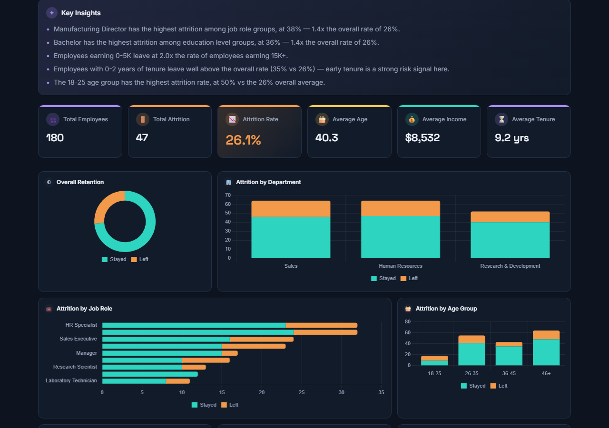
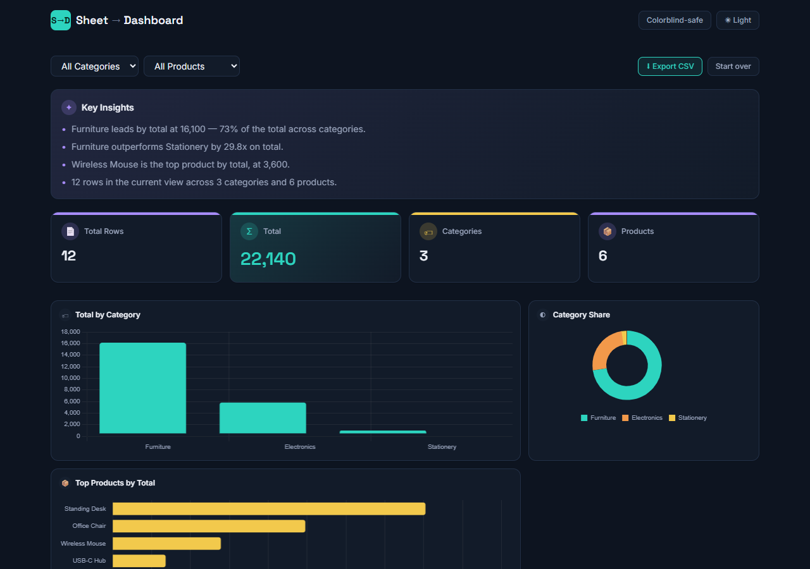

# Sheet → Dashboard

Turn any spreadsheet into an interactive analytics dashboard — entirely in
your browser. Upload a `.xlsx` / `.xls` / `.csv` file (or try the built-in
sample dataset), map your columns, and get a full BI-style dashboard: KPI
cards, breakdown charts, auto-generated insights, and click-to-filter
drill-down.

The app auto-detects what kind of data you gave it:

- **HR mode** — a spreadsheet with an attrition/churn-style column gets the
  full HR analytics treatment: retention/attrition breakdowns, a transparent
  per-employee risk score, and tenure/salary/age buckets.
- **Generic mode** — anything else (sales, inventory, orders, survey
  responses...) falls back to a general-purpose dashboard: group by
  **Category** and **Product**, measure any numeric column with
  Sum/Average/Row Count, and get the same KPI/chart/insight/filter treatment.

**No backend, no upload.** Parsing, cleaning, and analysis all run
client-side — your data never leaves the browser.

## Live Demo

- **Try it now:** [claude.ai artifact](https://claude.ai/code/artifact/7d4088cf-9eb6-4e52-a4f7-434b305bc3cc)
- **GitHub Pages:** https://faizan4356.github.io/Excel-to--Dashboard/

## Screenshots

**HR attrition mode** (sample dataset)



**Generic mode** (a small sales spreadsheet — Category/Product/Sales, no attrition column)



Full-page captures, including the risk-scoring table: [hr-dashboard.png](./screenshots/hr-dashboard.png) · [generic-dashboard.png](./screenshots/generic-dashboard.png)

## Features

- **3-stage flow** — Upload → Map columns → Dashboard, with a one-click
  "try sample data" path so it's demoable with no file at all.
- **Automatic dataset detection** — HR/attrition data gets the HR dashboard;
  anything else gets the generic Category/Product dashboard. No mode switch
  to configure.
- **Smart column mapping** — auto-guesses which uploaded column maps to each
  logical field (Attrition, Department, Category, Product, Measure, etc.),
  with full manual override.
- **Automatic data cleaning** — trims whitespace, normalizes blank
  placeholder tokens (`N/A`, `null`, `-`, etc.), drops empty/duplicate
  rows, and silently excludes implausible outliers (age, income, tenure)
  from averages and charts. A transparent "Data cleaned" summary shows
  exactly what was fixed.
- **KPI cards** with smooth animated count-up transitions.
- **Charts** — HR mode: overall retention donut, attrition by department /
  job role / age group / salary slab / education / tenure bucket / gender,
  plus an attrition-rate-over-time trend line. Generic mode: totals by
  Category, category share donut, top products, and a measure-over-time
  trend line — all driven by whatever numeric column you map.
- **Auto-generated insights** — plain-language takeaways computed from the
  current filtered view using simple, explainable comparison rules.
- **Attrition risk scoring** (HR mode) — a transparent, weighted
  per-employee risk score (Low / Medium / High), sortable and searchable,
  explicitly labeled as a heuristic rather than a predictive model.
- **Click-to-filter drill-down** — click any bar or donut slice to filter
  the whole dashboard; active filters show as removable chips.
- **CSV export** — download the currently filtered rows as a CSV file.
- **Colorblind-safe palette toggle** and full keyboard navigation.
- **Dark/light theme toggle**, responsive layout (dense 3-column chart
  grid on wide screens, KPI row becomes a swipeable strip on mobile).

## Tech Stack

- [React](https://react.dev/) + [Vite](https://vite.dev/) + TypeScript
- [Tailwind CSS](https://tailwindcss.com/) v4
- [SheetJS (xlsx)](https://sheetjs.com/) for client-side spreadsheet parsing
- [Chart.js](https://www.chartjs.org/) via [react-chartjs-2](https://react-chartjs-2.js.org/)

## How to Run Locally

```bash
npm install
npm run dev
```

Then open the printed local URL (typically `http://localhost:5173`).

To build a static production bundle (deployable to Vercel, Netlify, or
GitHub Pages):

```bash
npm run build
npm run preview   # serve the production build locally
```

To build for a GitHub Pages project site (serves from a `/<repo-name>/`
subpath instead of `/`):

```bash
GH_PAGES=1 npm run build
```

## What I Learned

- Building an in-browser data pipeline (parse → clean → normalize →
  aggregate) that stays fast and responsive as filters change on every
  interaction.
- Designing transparent, explainable heuristics (insights, risk scoring)
  instead of reaching for a black-box model — and making that tradeoff
  visible in the UI.
- Making charts double as filter controls (click-to-drill-down) without
  the interaction model becoming confusing.
- Generalizing a purpose-built schema (HR attrition) into a mode-detected
  system that also handles arbitrary category/product data without forking
  the codebase.
